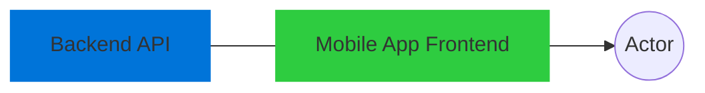

# ApplyAble Developer Documentation

### What we'll build
The project brief has already been defined. In essence, we're building a "dating app". The dating app will majorly have two components:



The frontend will be built on **React Native** and will be relatively very simple, only calling the backend APIs and displaying the views. This brief majorly concerns the **backend architecture**.

We will use a lot of the practices from the **CSSE6400 Cloud Assignment** in our project, including the use of `Docker, Docker-compose, PostgreSQL, Terraform, ECS, SQS`, and other AWS services.

### Building the API
Instead of trying to build everything manually (which is prone to errors), we will automate almost all of the process for building the backend API using in dustry standard tools. 

> You are requested to go through the *prerequisites*, and *FAQs* thoroughly so that you can understand why we're doing what we're doing.

**Prerequisites**

[What is an OpenAPI spec?](https://www.openapis.org/what-is-openapi)

When we are designing an API, we can choose any path for our endpoints. For example
`@api.route('/users/')` and `@api.route('/get_users/')`  are both valid. However, there are standards to defining APIs around the world so that developers can easily understand or guess it. One of those standards is the OpenAPI standard.

[What is Swagger?](https://swagger.io/blog/api-strategy/difference-between-swagger-and-openapi/)

Swagger is a tool to help define OpenAPI spec. Swagger codegen is a tool to automatically generate code for an OpenAPI spec. Swagger Hub is a directory of numerous OpenAPI specs. We can get a sample spec for a dating app there, to compare our API to industry standards.

[What is an ORM?](https://www.freecodecamp.org/news/what-is-an-orm-the-meaning-of-object-relational-mapping-database-tools/)

ORM (Object Relational Mapping) is a way to map Object Oriented Programming Models to Databases so that we don't have to define database classes in raw SQL manually. SQLAlchemy is one such ORM tool.
Example:
```python
class User(Base):
    __tablename__ = 'users'

    id = Column(Integer, primary_key=True)
    name = Column(String(50))
    email = Column(String(100))
```

instead of
```python
create_table_query = '''
    CREATE TABLE users (
        id SERIAL PRIMARY KEY,
        name VARCHAR(50),
        email VARCHAR(100)
    )
'''

# Execute the SQL statement
cursor.execute(create_table_query)
```

[What is Connexion?](https://pypi.org/project/connexion/1.0.38/)


**Process**
- We will adapt an existing **OpenAPI** spec or make one to clearly define our API. ([Example Spec](https://app.swaggerhub.com/apis/Alsouidan/Tinder/1.0.0))
- We will model our classes *(Users, Chats etc.)* using the **ORM (SQLAlchemy)**.
- We will then define our methods by coding ourselves or using **ChatGPT**.
Example:
```python
def get_users():
    users = User.query.all()
    user_list = [{'id': user.id, 'name': user.name, 'email': user.email} for user in users]
    return {'users': user_list}, 200
```
> Note that we haven't defined anything like `@api.route('/users/<int:user_id>')` here because we'll do that automatically using `Connexion` later
- We will then use **Connexion** to link our methods and resources to the OpenAPI spec.

**FAQs**

**Q.** Why aren't we doing it like we did the assignment?

**A.** We had just 7-8 endpoints in the assignment. Once we tackle something of [this scale](https://app.swaggerhub.com/apis/Alsouidan/Tinder/1.0.0), it becomes exponentially more difficult to debug and keep track of errors.

**Q.** Why do we use Connexion? Why can't we just
```python
@api.route('/users/<int:user_id>')
def get_user(user_id):
	...
```
like we did in the assignments?

**A.** Again, when we have like 20-40 endpoints, managing each endpoint separately becomes a major hassle. That is why we separate the **spec** (`@api.route('/users/<int:user_id>')`), from its implementation. That way, we can define all the specs all at once and keep making the implementations later.

___
### Deploying the API
We will use the approach used in the CSSE6400 tuts and assignment to manage our deployments smoothly.

**Local Development**
We will use `docker-compose` for local development and testing, with multiple containers for the APIs

**Deployment**
We will use `terraform` with `ECS` and `RDS` to deploy online.

___
**Resources**
[Microservices project example](https://blog.muhib.me/introduction-to-microservices)
[Generating API Code using Swagger]()
[Testing APIs using Swagger](https://articles.wesionary.team/swagger-ui-on-docker-for-testing-rest-apis-5b3d5fcdee7)


